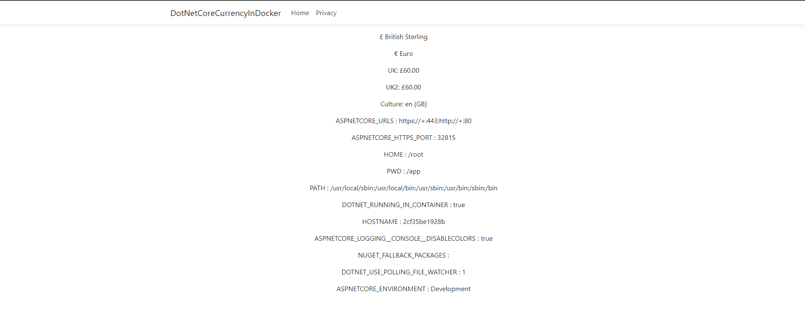

# Problem

When running docker-compose up its displayed a � instead of £ - however it works with the Visual studio built in docker-compose :/

## Screenshots

### Debug - Self Hosted Kestrel

### Debug - Docker in Visual Studio (may need to unload/delete the dcproj to get this option)

### Debug - Docker-Compose via VisualStudio's built in tools

### Command Line - running `docker-compose.exe up --build`

